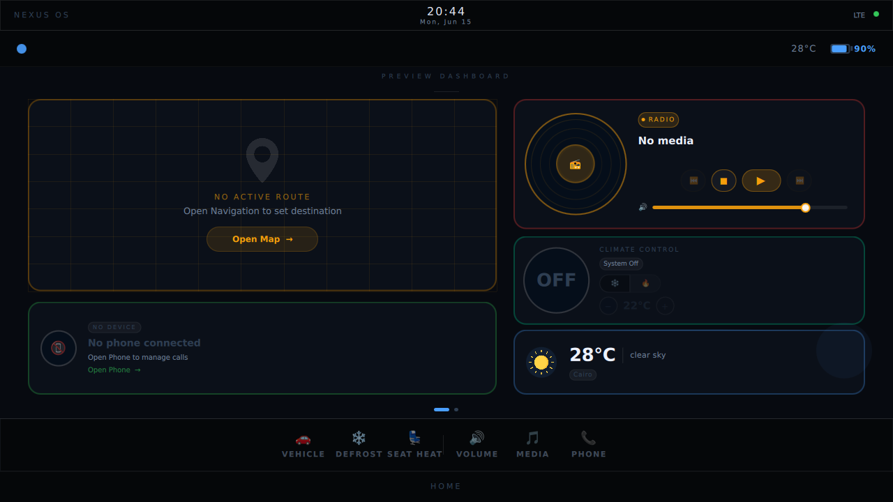
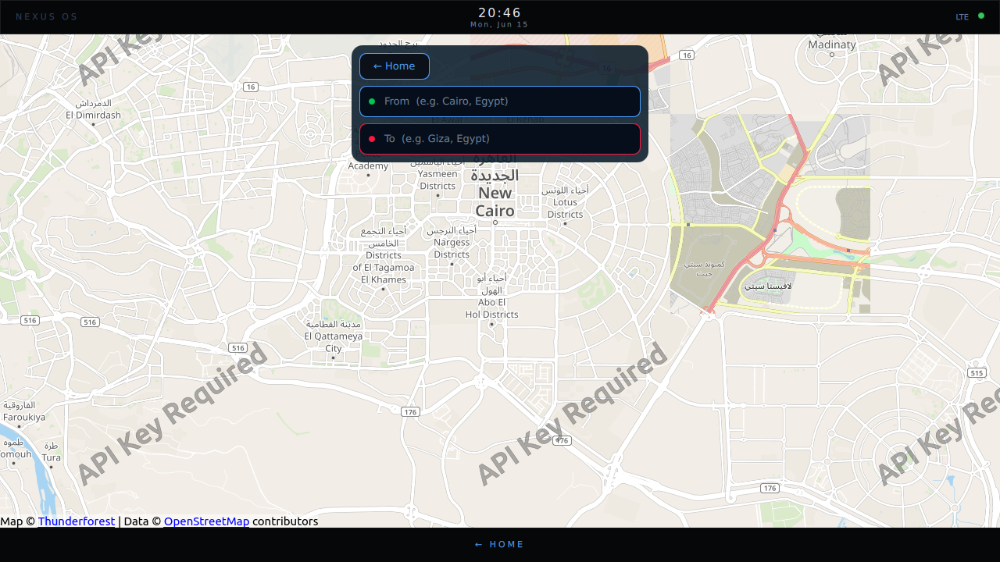
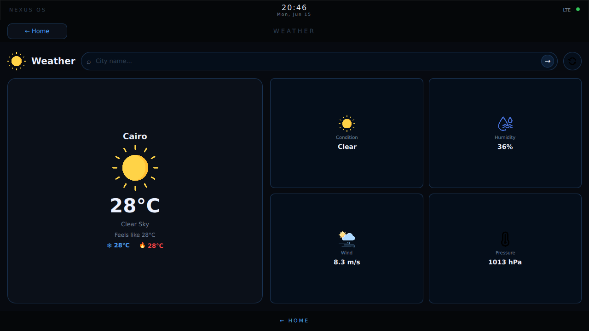
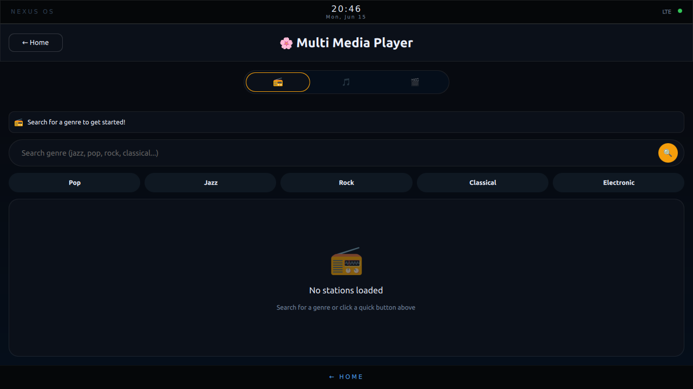
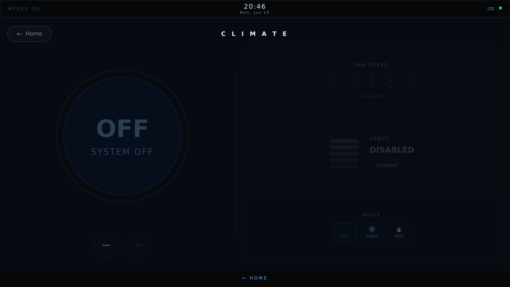
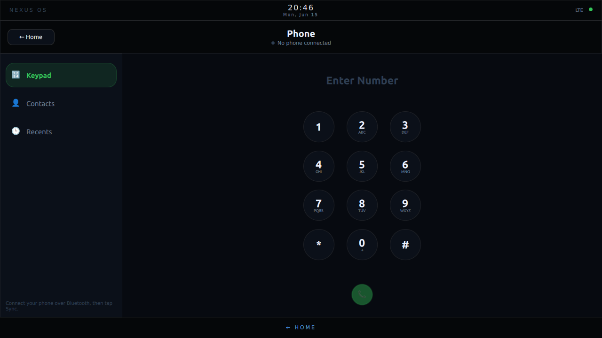
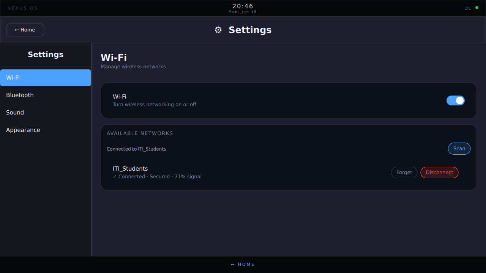
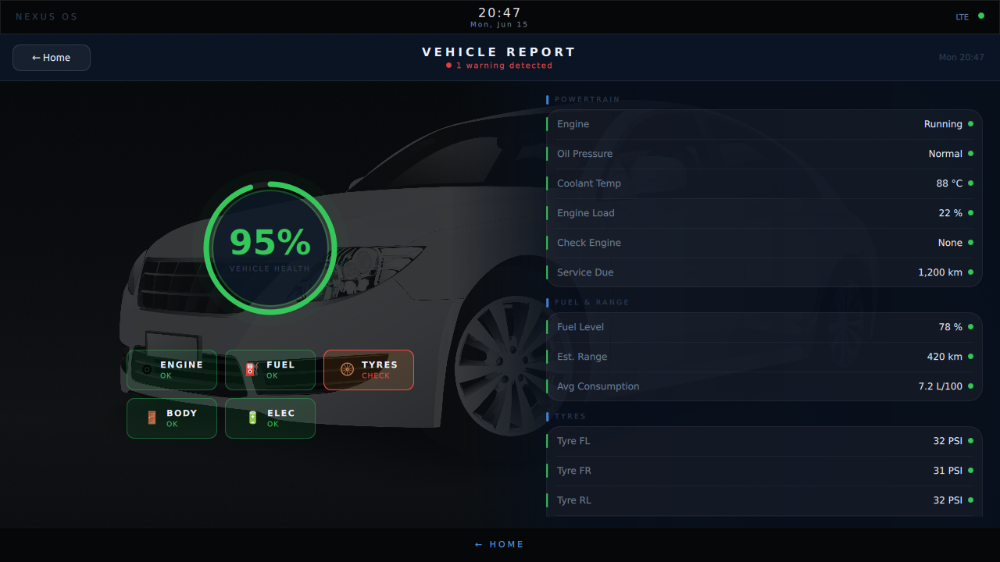
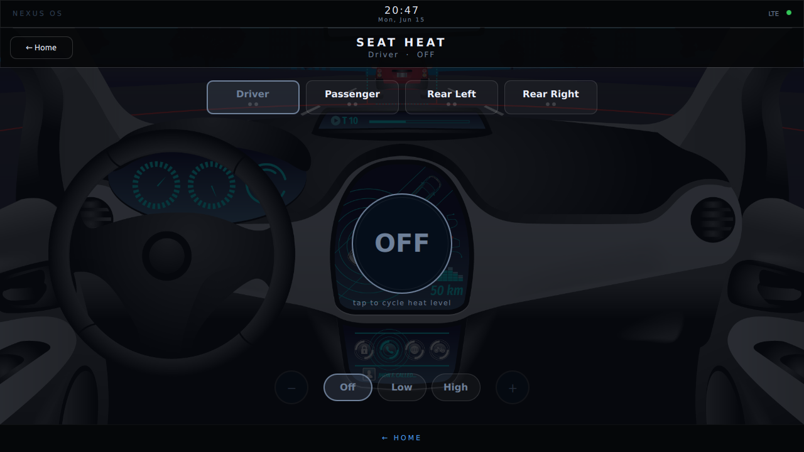

# IVIAutomotive — NEXUS Infotainment System

A touch-screen **In-Vehicle Infotainment (IVI)** head-unit built with **Qt 6 / QML** and a
C++ backend. It boots into a NEXUS-branded home launcher and hosts a full suite of
automotive apps — navigation, media, climate, phone, weather and system settings — all
designed for a 1280×720 touch display with an on-screen virtual keyboard.

## Features

| App | Description | Backend |
| --- | --- | --- |
| **Launcher** | Animated splash + app grid, status bar (live clock, LTE), bottom "HOME" nav bar | `Main.qml`, `qml/applauncher/` |
| **Navigation** | Interactive map view via Qt Location (OpenStreetMap) | `qml/navigation/` |
| **Media** | Local audio/video, FM radio, and Bluetooth A2DP audio streaming | `AudioManager`, `VideoManager`, `RadioManager`, `BluetoothManager` |
| **Phone** | Bluetooth phone integration (calls & contacts over BlueZ/DBus) | `PhoneManager` |
| **Climate (HVAC)** | Temperature, fan and seat-heat controls | `qml/HVAC/`, `qml/applauncher/SeatHeatPage.qml` |
| **Weather** | Live forecast from OpenWeatherMap | `WeatherViewModel`, `networkhandler` |
| **YouTube / SoundCloud** | Embedded web views via Qt WebEngine (custom UA, autoplay) | `qml/youtube/`, `qml/spotify/` |
| **Vehicle** | Vehicle status / report dashboard | `qml/applauncher/VehiclePage.qml` |
| **Settings** | Theme, volume, Wi-Fi and Bluetooth configuration | `settingsmanager`, `soundmanager`, `wifimanager` |
| **Virtual Keyboard** | System-wide on-screen keyboard for all text inputs (QML + web) | Qt Virtual Keyboard |

## Screenshots

### Home Dashboard
The launcher boots into a live dashboard (map preview, media, climate, weather & phone
cards) with a quick-action bottom bar.



### Navigation & Weather

| Navigation (OpenStreetMap) | Weather (OpenWeatherMap) |
| --- | --- |
|  |  |

### Media & Climate

| Media player (radio / audio / video) | Climate (HVAC) |
| --- | --- |
|  |  |

### Phone & Settings

| Phone (Bluetooth) | Settings (Wi-Fi / BT / Sound / Appearance) |
| --- | --- |
|  |  |

### Vehicle & Seat Heat

| Vehicle report | Seat heat control |
| --- | --- |
|  |  |

## Tech Stack

- **Qt 6.8+** (developed/tested against **Qt 6.10.3**, `gcc_64`)
- **C++17** backend exposed to QML via context properties
- Qt modules: `Quick`, `WebEngineQuick`, `Location`, `Positioning`, `Quick3D`,
  `Network`, `DBus`, `Multimedia`, `VirtualKeyboard`
- System deps: **ALSA**, **GStreamer 1.0**, **BlueZ** (Bluetooth over DBus)
- Build system: **CMake** (≥ 3.16) with `qt_add_qml_module`

## Project Structure

```
IVIAutomotive/
├── Main.qml              # Root window: splash, status bar, screen stack, virtual keyboard
├── AppTheme.qml          # Centralized theme (colors, fonts, timings)
├── main.cpp              # App entry: WebEngine init, backend wiring, QML engine
├── CMakeLists.txt        # Build + QML module definition
├── assets/ + assets.qrc  # Icons, images, 3D meshes, maps
└── qml/
    ├── applauncher/      # Home grid, Vehicle & SeatHeat pages
    ├── navigation/       # Map / navigation
    ├── media/            # Audio, video, radio, Bluetooth managers + pages
    ├── phone/            # Bluetooth phone
    ├── HVAC/             # Climate control
    ├── weather/          # OpenWeatherMap view model + network
    ├── settings/         # Settings backend + pages (theme/volume/wifi/bluetooth)
    ├── youtube/          # YouTube WebEngine view
    └── spotify/          # SoundCloud WebEngine view
```

> Note: `qml/mediaplayer/` is a legacy/early version superseded by `qml/media/`.

## Building

This is a CMake-based Qt project. The QML is compiled into the binary via
`qt_add_qml_module`, so **every QML file must be listed in `CMakeLists.txt`** and QML
edits require a rebuild.

### Prerequisites

- Qt 6.8+ (6.10.3 recommended) with the modules listed above
- ALSA dev libs, GStreamer 1.0 dev libs, BlueZ
- A C++17 compiler, CMake ≥ 3.16, Ninja

### Configure & build

```bash
# From the project root, using the Qt 6.10.3 kit
cmake -G Ninja \
  -DCMAKE_PREFIX_PATH=/home/abdo/Qt/6.10.3/gcc_64 \
  -B build/Desktop_Qt_6_10_3-Debug

cmake --build build/Desktop_Qt_6_10_3-Debug
```

Opening the project in **Qt Creator** with the Qt 6.10.3 kit also works out of the box.

## Running

```bash
./build/Desktop_Qt_6_10_3-Debug/appIVIAutomotive
```

The window is titled **"HMI System"** (1280×720).

- **Headless smoke test:** `QT_QPA_PLATFORM=offscreen ./.../appIVIAutomotive`
  and check stderr for `qml:` errors. Screens other than the launcher only load on
  navigation, so binding errors there surface only once you open the app.

## Configuration Notes

- **Weather** uses the OpenWeatherMap API (`api.openweathermap.org/data/2.5/weather`).
  Set your API key in `qml/weather/networkhandler.cpp`.
- **Navigation** uses the OpenStreetMap (OSM) Qt Location plugin — no key required.
- **WebEngine** apps (YouTube, SoundCloud) set a desktop user-agent per profile and run
  with `--autoplay-policy=no-user-gesture-required` for kiosk-style autoplay.
- **Bluetooth** (media + phone) talks to **BlueZ over DBus**; a running BlueZ stack and a
  paired device are required for audio streaming and phone features.
